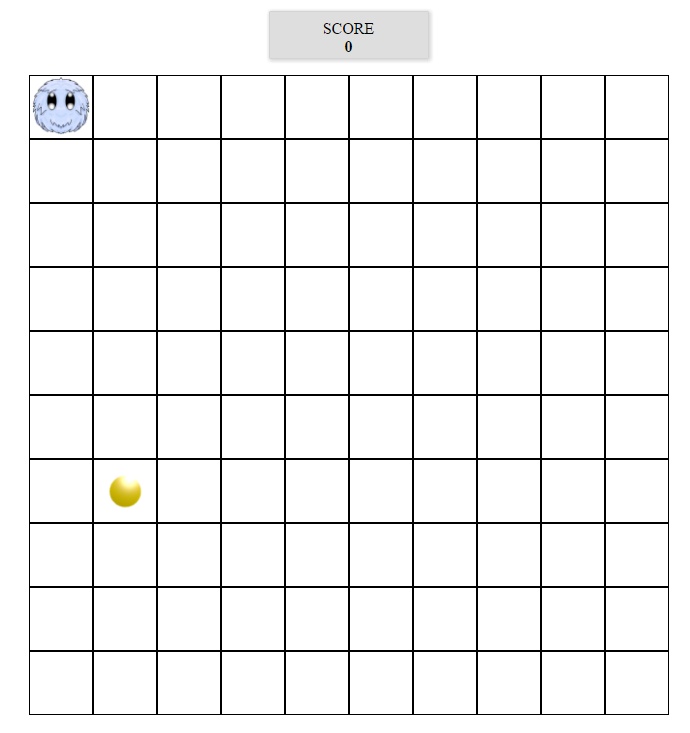

# Furry Game

## Description

The workshop aims to improve some JS elements:
* events handling;
* dividing, importing & exporting .js files;
* working with multiple objects, constructors, prototypes;
* using setTimeout and setInterval methods;

## Principal of working

The game consists of a board which is bulit of divs. On the board there is a sprite (Furry). It is controlled by user keyboard. Furry has to collect a coin which appears randomly on the board. Each time the coin is collected, the score displayed above the board increases by 1. The games ends if Furry touches the board threshold. A final screen is displayed with user's score and a 'Reload button'.

